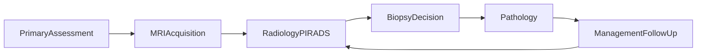

# Prostate cancer screening and diagnostic workflow

This page describes the **clinical and programme pathway** for Lithuanian **prostate cancer prevention and early diagnosis** (ADPP / programme context), aligned with structured **laboratory**, **imaging**, **radiology assessment**, and **pathology** reporting. Earlier steps use **LT Base**, **LT VitalSigns**, **LT Lab**, and **LT Lifestyle** for demographics, vitals, labs, and behavioural data where applicable.

FHIR resources from **this IG** focus on **prostate MRI interpretation** (PI-RADS, PI-QUAL, PRECISE, lesion modelling) and the **programme imaging document** (**ProstateReport** + **ProstateComposition**). **LT Lab** carries **pathology** documents; see the **[pathology workflow in LT Lab](https://build.fhir.org/ig/HL7LT/ig-lt-lab/pathology-workflow.html)**.

### Primary care assessment and referral

The pathway starts with a **primary care or urology** visit (patient present): **PSA** testing, optional **digital rectal examination (DRE)**, and clinical context for referral. PSA and related labs are typically **Observation** resources (LT Lab / base patterns); anthropometrics and vitals may use **LT VitalSigns** profiles.

### MRI acquisition (data acquisition)

If indicated, **bpMRI** or **mpMRI** of the prostate is performed. This step captures **ImagingStudy** and acquisition context; it does **not** by itself record radiological conclusions.

### Radiology evaluation and PI-RADS assessment

The radiologist interprets sequences (T2, DWI, ADC, optional DCE), defines **lesions** (e.g. **LesionLtProstate** / body structures), assigns **sequence scores** (**SequenceScoreLtProstate**), **PI-RADS** (**PIRADSAssessmentLtProstate**), exam-level **PI-QUAL** (**PiqualObservationLtProstate**), and follow-up **PRECISE** (**PreciseAssessmentLtProstate**) where applicable.

### Clinical decision and biopsy indication

Decisions (surveillance, repeat imaging, **biopsy**) follow programme rules and PI-RADS; represent orders and procedures with **ServiceRequest** / **Procedure** patterns from Base or EU as appropriate.

### Pathology examination and diagnosis (if biopsy)

Biopsy material is described in **LT Lab** (**PathologyReportLtLab**, **PathologyCompositionLtLab**). Gleason / ISUP may appear as **GleasonIsupObservationLtProstate** in imaging follow-up context when linked to pathology conclusions. Example pathology report: [DiagnosticReport: Pathology (example)](https://build.fhir.org/ig/HL7LT/ig-lt-lab/DiagnosticReport-diagnosticreport-pathology-report-example.html).

### Management planning and follow-up

Longitudinal care uses repeat **PSA**, **MRI**, and **PRECISE** tracking. **CarePlan** or programme-specific documentation may be added when profiled.

## Programme document bundle (Prostate report + composition)

For a **single exchangeable imaging-class record** aligned with **LT Base** **ImagingReportLt**, this guide defines **[ProstateReportLtProstate](StructureDefinition-prostate-report-lt-prostate.html)** and **[ProstateCompositionLtProstate](StructureDefinition-prostate-composition-lt-prostate.html)**. The **DiagnosticReport** lists **Observation** results (PSA-related data may appear in **supportingInfo**; PI-RADS, PI-QUAL, PRECISE, etc. in **result**). The **Composition** uses the **imaging composition** section layout (study, order, history, procedure, comparison, findings, impression, recommendation). **Pathology DiagnosticReport** is **not** placed in `result` (see **DiagnosticReportLt**); link it via **LT Lab** bundles or encounter as in the **[prostate report](prostate-report.html)** page.

**Examples in this IG**

* [DiagnosticReport: Prostate programme report (example)](DiagnosticReport-diagnosticreport-prostate-programme-report-example.html)
* [Composition: Prostate programme document (example)](Composition-composition-prostate-programme-example.html)

**Specialised mpMRI profile:** **[MpMRIReportLtProstate](StructureDefinition-mpmri-report-lt-prostate.html)** remains the **EU ImDiagnosticReport**-aligned profile for detailed mpMRI exchange; use **ProstateReportLtProstate** when the **national ImagingReport** pattern is required.

## ESPBI electronic forms (Questionnaire)

National **ESPBI** forms (including pathology report fields aligned with programme spreadsheets) can be represented as **[Questionnaire](https://hl7.org/fhir/questionnaire.html)** / **[QuestionnaireResponse](https://hl7.org/fhir/questionnaireresponse.html)** — see **[Questionnaires](questionnaire.html)** for **coverage vs source spreadsheets**, **ConceptMap** mappings to LT profiles, and examples. They are **orthogonal** to **ProstateReport** / **Composition**.

## Cross-IG examples (CI Build)

Illustrative published examples for measurements and behaviour often linked from programme assessment:

* [Blood pressure (VitalSigns)](https://build.fhir.org/ig/HL7LT/ig-lt-vitalsigns/Observation-observation-blood-pressure-example.html)
* [Body height (VitalSigns)](https://build.fhir.org/ig/HL7LT/ig-lt-vitalsigns/Observation-observation-body-height-example.html)
* [Tobacco use (Lifestyle)](https://build.fhir.org/ig/HL7LT/ig-lt-lifestyle/Observation-observation-tobacco-use-current-smoker-example.html)
* [Alcohol consumption (Lifestyle)](https://build.fhir.org/ig/HL7LT/ig-lt-lifestyle/Observation-observation-alcohol-consumption-no-example.html)

## Detailed clinical narrative (lesions, PI-RADS, PRECISE)

The following sections expand **how** lesion-level and exam-level assessments are modelled in this IG (profiles and observations).

### Laboratory-based screening

The workflow typically begins with **Prostate-Specific Antigen (PSA)** testing. The PSA result is captured as a structured laboratory **Observation** and often triggers further evaluation.

### Imaging acquisition (prostate MRI)

If further evaluation is indicated, a prostate MRI examination is ordered (**bpMRI** or **mpMRI**). During acquisition, the patient is present; data represent technical acquisition only.

### Radiological evaluation and lesion identification

The radiologist reviews MRI sequences and identifies one or more prostate **lesions**, with localisation using the **PI-RADS 39-sector model**, zone, level, side, and position.

### Lesion-level sequence scoring

For each lesion, **SequenceScoreLtProstate** observations capture T2, DWI, ADC, and optionally DCE scores.

### PI-RADS lesion-level assessment

**PIRADSAssessmentLtProstate** gives a **lesion-level** PI-RADS category. Multiple lesions may have different scores.

### Image quality assessment (PI-QUAL)

**PiqualObservationLtProstate** is an **exam-level** image quality score.

### Compilation into MRI diagnostic report

Findings are compiled into a structured report. Use **[MpMRIReportLtProstate](StructureDefinition-mpmri-report-lt-prostate.html)** for EU-aligned mpMRI reports, or **[ProstateReportLtProstate](StructureDefinition-prostate-report-lt-prostate.html)** for the **ImagingReportLt** programme anchor.

### Clinical decision-making based on PI-RADS

Clinical assessment is separated from workflow decisions (referral, biopsy). PI-RADS drives actions such as surveillance vs biopsy referral.

### Prostate biopsy and pathology

Biopsy and **LT Lab** pathology reporting follow **[LT Lab pathology workflow](https://build.fhir.org/ig/HL7LT/ig-lt-lab/pathology-workflow.html)**.

### Longitudinal follow-up and PRECISE assessment

**PreciseAssessmentLtProstate** summarises change vs a prior MRI (regression, stability, progression).

### Communication and longitudinal care

The structured model supports PSA trends, serial MRI, PRECISE, and integration with pathology for shared decision-making.

## Overview diagram

The loop from **ManagementFollowUp** back to **RadiologyPIRADS** reflects **repeat MRI** and **surveillance** over time.
