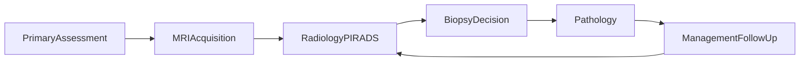

# Overview: The Longitudinal Care Pathway

## Prostate cancer screening and diagnostic workflow

The prostate cancer workflow is a structured, longitudinal process supporting **early detection**, **risk stratification**, and **diagnosis**. It transitions from population-based laboratory screening to advanced lesion-level imaging, culminating in multidisciplinary clinical decisions (including **laboratory**, **imaging**, **radiology assessment**, and **pathology** reporting).

In the digital ecosystem, this is represented by a Prostate Programme Report, which pairs a structured DiagnosticReport (the data anchor) with a Composition (the human-readable narrative). Earlier steps use **LT Base**, **LT VitalSigns**, **LT Lab**, and **LT Lifestyle** for demographics, vitals, labs, [pathology workflows](https://build.fhir.org/ig/HL7LT/ig-lt-lab/pathology-workflow.html) and behavioural data where applicable.

## Programme Enrollment & Eligibility

The ADPP (Early Diagnosis and Prevention Programme) tracks participants via **[ScreeningCarePlanLtProstate](StructureDefinition-screening-careplan-lt-prostate.html)**, which captures enrolment status, risk group, and scheduled activities.

### Target population criteria

| Criteria | Standard group | Increased risk group |
|----------|---------------|---------------------|
| **Sex** | Male | Male |
| **Age** | 50–69 years (inclusive) | 45–49 years (inclusive) |
| **Family history** | — | Father or brother diagnosed with prostate cancer |
| **Periodicity** | PSA every 2 years | PSA every 2 years |

**Special rules:**
- Men up to 59 years with PSA < 1 ng/ml: service no more than once every 5 years
- Men 60–69 years with PSA < 1 ng/ml: no longer invited to participate

Family history is captured using **[FamilyMemberScreeningHistoryLtLifestyle](https://build.fhir.org/ig/HL7LT/ig-lt-lifestyle/StructureDefinition-family-member-screening-history-lt-lifestyle.html)** from **LT Lifestyle** with SNOMED situation codes (414205003 prostate, 429740004 breast, 2301000119106 ovarian, 312824007 colon cancer).

## Phase I: Screening & Laboratory Evaluation

* The process typically begins with a **primary care or urology** encounter, **Prostate-Specific Antigen (PSA)** testing, and **[digital rectal examination (DRE)](StructureDefinition-dre-observation-lt-prostate.html)**.
* Clinical Trigger: A clinician initiates PSA testing as part of routine screening or clinical indication.
* Data Representation: PSA results are captured as structured Observation resources. These serve as the primary trigger for referral to imaging.

### PSA threshold decision rules

| PSA result | Age | Action |
|-----------|-----|--------|
| PSA < 1 ng/ml | up to 59 years | Re-invite after **5 years** (T16) |
| PSA 1–3 ng/ml | up to 69 years | Re-invite after **2 years** (T17) |
| PSA < 1 ng/ml | 60–69 years | **Exit programme** — no longer invited (T18) |
| PSA > 3 ng/ml | any | **Referral to urologist** (T19, form E027) |

Contextual Data: Supporting information such as age, trends over time, lifestyle factors (e.g., tobacco or alcohol use from **LT Lifestyle** profiles), and anthropometrics and vitals (use **LT VitalSigns** profiles — [BodyHeight](https://build.fhir.org/ig/HL7LT/ig-lt-vitalsigns/StructureDefinition-body-height.html), [BodyWeight](https://build.fhir.org/ig/HL7LT/ig-lt-vitalsigns/StructureDefinition-body-weight.html), [BMI](https://build.fhir.org/ig/HL7LT/ig-lt-vitalsigns/StructureDefinition-bmi.html)) are linked to provide clinical context. Anticoagulant use is captured via **[MedicationStatementLtLifestyle](https://build.fhir.org/ig/HL7LT/ig-lt-lifestyle/StructureDefinition-medication-statement-lt-lifestyle.html)**.

### Referral forms (ESPBI)

The programme uses the following ESPBI electronic forms for referrals:

| Step | Form | Description | Questionnaire |
|------|------|-------------|---------------|
| T19 | **E027** | Referral to urologist | [ADPP Questionnaire](Questionnaire-questionnaire-prostate-adpp-primary-assessment.html) |
| T22 | **E027** | Referral to radiologist for mpMRI | Radiologist Referral Questionnaire |
| T26 | **E014** | Referral to pathologist (biopsy order) | Pathologist Referral Questionnaire |
| T29 | **E090/a** | First-time oncological diagnosis report | — |

### Phase II: Imaging Acquisition & Quality (MRI)

If indicated by PSA levels or clinical risk, a prostate MRI—either **biparametric (bpMRI)** or **multiparametric (mpMRI)** — is performed.

* **Imaging Acquisition:** Technical data is captured as imaging resources. At this stage, no interpretation is recorded.
* **PI-QUAL Assessment:** The radiologist assigns a **PI-QUAL score** at the exam level. This indicates whether the image quality is sufficient for a reliable PI-RADS assessment.
* **Technical Mapping:** Use MpMRIReportLtProstate for EU-aligned reporting or ProstateReportLtProstate for national-level compliance.

### Phase III: Radiological Evaluation (Lesion-Level)

Radiologists identify and score individual lesions using the PI-RADS framework.

**Lesion Identification**

Each lesion is treated as a structured anatomical entity using the PI-RADS 39-sector model, documenting:
* Localization: Zone, level (base, mid-gland, apex), side, and position.
* Morphology: Relevant descriptors and anatomical anchors.

**Sequence & PI-RADS Scoring**

For each identified lesion, individual sequence scores (T2W, DWI, ADC, and DCE) are assigned. These culminate in the **PI-RADS Assessment**, representing the likelihood of clinically significant cancer for _that specific lesion_.

### Phase IV: The Structured Diagnostic Report

All findings are compiled into a coherent programme record. This record consists of two primary technical components:

| Component | Resource Type | Content |
| --- | --- | --- |
| Data Report | DiagnosticReport | Structured result list of Observations (PI-RADS, PI-QUAL, sequence scores, etc.) |
| Narrative | Doc	Composition | Human-readable sections: Findings, Impression, and Recommendations. |

Note: Pathology results (Gleason/ISUP) are linked via the Encounter or supportingInfo but remain mastered within the LT Lab pathology workflow to avoid data duplication.

### Phase V: Biopsy & Pathological Conclusion

If MRI reveals high-risk (PI-RADS 4-5) or concerning intermediate (PI-RADS 3) lesions, a biopsy is performed.

* **Procedure:** Image-guided biopsy samples are taken from targeted and/or systematic regions.
* **Pathology:** Tissue analysis provides the definitive diagnosis, including Gleason grading and tumour classification.
* **Integration:** These results are linked back to the imaging context to enable a complete clinical picture.

### Phase VI: Longitudinal Follow-up (PRECISE)

For patients in Active Surveillance, repeat MRIs are monitored using the PRECISE framework.

* **Exam-Level Assessment:** Unlike PI-RADS (lesion-specific), PRECISE evaluates the overall disease change (Regression, Stability, or Progression) compared to prior exams.
* **Tracking:** The structured model enables the linkage of specific lesions across time, allowing for standardized tracking of disease evolution.

### Clinical Decision Logic Summary

The workflow maintains a strict separation between Assessment (the data) and Decision (the action).

* **Low PI-RADS:** Continued screening or routine follow-up.
* **Intermediate PI-RADS:** Short-interval follow-up or further evaluation.
* **High PI-RADS:** Referral to urology for biopsy.

## Programme document bundle (Prostate report + composition)

For a **single exchangeable imaging-class record** aligned with **LT Base** **ImagingReportLt**, this guide defines **[ProstateReportLtProstate](StructureDefinition-prostate-report-lt-prostate.html)** and **[ProstateCompositionLtProstate](StructureDefinition-prostate-composition-lt-prostate.html)**. The **DiagnosticReport** lists **Observation** results (PSA-related data may appear in **supportingInfo**; PI-RADS, PI-QUAL, PRECISE, etc. in **result**). The **Composition** uses the **imaging composition** section layout (study, order, history, procedure, comparison, findings, impression, recommendation). **Pathology DiagnosticReport** is **not** placed in `result` (see **DiagnosticReportLt**); link it via **LT Lab** bundles or encounter as in the **[prostate report](prostate-report.html)** page.

**Examples in this IG**

* [DiagnosticReport: Prostate programme report (example)](DiagnosticReport-diagnosticreport-prostate-programme-report-example.html)
* [Composition: Prostate programme document (example)](Composition-composition-prostate-programme-example.html)

**Specialised mpMRI profile:** **[MpMRIReportLtProstate](StructureDefinition-mpmri-report-lt-prostate.html)** remains the **EU ImDiagnosticReport**-aligned profile for detailed mpMRI exchange; use **ProstateReportLtProstate** when the **national ImagingReport** pattern is required.

## ESPBI electronic forms (Questionnaire)

National **ESPBI** forms (including pathology report fields aligned with programme spreadsheets) can be represented as **[Questionnaire](https://hl7.org/fhir/questionnaire.html)** / **[QuestionnaireResponse](https://hl7.org/fhir/questionnaireresponse.html)** — see **[Questionnaires](questionnaire.html)** for **coverage vs source spreadsheets**, **ConceptMap** mappings to LT profiles, and examples. They are **orthogonal** to **ProstateReport** / **Composition**.

## Cross-IG examples (CI Build)

Illustrative published examples for measurements and behaviour often linked from programme assessment:

* [Blood pressure (VitalSigns)](https://build.fhir.org/ig/HL7LT/ig-lt-vitalsigns/Observation-observation-blood-pressure-example.html)
* [Body height (VitalSigns)](https://build.fhir.org/ig/HL7LT/ig-lt-vitalsigns/Observation-observation-body-height-example.html)
* [Tobacco use (Lifestyle)](https://build.fhir.org/ig/HL7LT/ig-lt-lifestyle/Observation-observation-tobacco-use-current-smoker-example.html)
* [Alcohol consumption (Lifestyle)](https://build.fhir.org/ig/HL7LT/ig-lt-lifestyle/Observation-observation-alcohol-consumption-no-example.html)

## Detailed clinical narrative (lesions, PI-RADS, PRECISE)

The following sections expand **how** lesion-level and exam-level assessments are modelled in this IG (profiles and observations).

### Laboratory-based screening

The workflow typically begins with **Prostate-Specific Antigen (PSA)** testing. The PSA result is captured as a structured laboratory **Observation** and often triggers further evaluation.

### Imaging acquisition (prostate MRI)

If further evaluation is indicated, a prostate MRI examination is ordered (**bpMRI** or **mpMRI**). During acquisition, the patient is present; data represent technical acquisition only.

### Radiological evaluation and lesion identification

The radiologist reviews MRI sequences and identifies one or more prostate **lesions**, with localisation using the **PI-RADS 39-sector model**, zone, level, side, and position.

### Lesion-level sequence scoring

For each lesion, **SequenceScoreLtProstate** observations capture T2, DWI, ADC, and optionally DCE scores.

### PI-RADS lesion-level assessment

**PIRADSAssessmentLtProstate** gives a **lesion-level** PI-RADS category. Multiple lesions may have different scores.

### Image quality assessment (PI-QUAL)

**PiqualObservationLtProstate** is an **exam-level** image quality score.

### Compilation into MRI diagnostic report

Findings are compiled into a structured report. Use **[MpMRIReportLtProstate](StructureDefinition-mpmri-report-lt-prostate.html)** for EU-aligned mpMRI reports, or **[ProstateReportLtProstate](StructureDefinition-prostate-report-lt-prostate.html)** for the **ImagingReportLt** programme anchor.

### Clinical decision-making based on PI-RADS

Clinical assessment is separated from workflow decisions (referral, biopsy). PI-RADS drives actions such as surveillance vs biopsy referral.

### Prostate biopsy and pathology

Biopsy is performed using **[BiopsyProcedureLtLab](https://build.fhir.org/ig/HL7LT/ig-lt-lab/StructureDefinition-biopsy-procedure-lt-lab.html)** from **LT Lab**. Biopsy orders follow **[PathologyOrderLtLab](https://build.fhir.org/ig/HL7LT/ig-lt-lab/StructureDefinition-pathology-order-lt-lab.html)**. Specimens are tracked via **[SpecimenLtLab](https://build.fhir.org/ig/HL7LT/ig-lt-lab/StructureDefinition-specimen-lt-lab.html)** and **[SpecimenBlockLtLab](https://build.fhir.org/ig/HL7LT/ig-lt-lab/StructureDefinition-specimen-block-lt-lab.html)**. Pathology results are structured in **[PathologyReportLtLab](https://build.fhir.org/ig/HL7LT/ig-lt-lab/StructureDefinition-pathology-report-lt-lab.html)** with **[PathologyCompositionLtLab](https://build.fhir.org/ig/HL7LT/ig-lt-lab/StructureDefinition-pathology-composition-lt-lab.html)**. TNM staging uses **[ProstateConditionLtLab](https://build.fhir.org/ig/HL7LT/ig-lt-lab/StructureDefinition-prostate-condition-lt-lab.html)**.

Additional lab observations: **[SpecimenAdequacyLtLab](https://build.fhir.org/ig/HL7LT/ig-lt-lab/StructureDefinition-specimen-adequacy-lt-lab.html)** (specimen quality), **[SpecimenMeasurementLtLab](https://build.fhir.org/ig/HL7LT/ig-lt-lab/StructureDefinition-specimen-measurement-lt-lab.html)** (bioptate length), **[TumorObservableLtLab](https://build.fhir.org/ig/HL7LT/ig-lt-lab/StructureDefinition-tumor-observable-lt-lab.html)** (tumour characteristics).

Full pathology workflow: **[LT Lab pathology workflow](https://build.fhir.org/ig/HL7LT/ig-lt-lab/pathology-workflow.html)**.

### Longitudinal follow-up and PRECISE assessment

**PreciseAssessmentLtProstate** summarises change vs a prior MRI (regression, stability, progression).

### Communication and longitudinal care

The structured model supports PSA trends, serial MRI, PRECISE, and integration with pathology for shared decision-making.

## Overview diagram

The loop from **ManagementFollowUp** back to **RadiologyPIRADS** reflects **repeat MRI** and **surveillance** over time.
